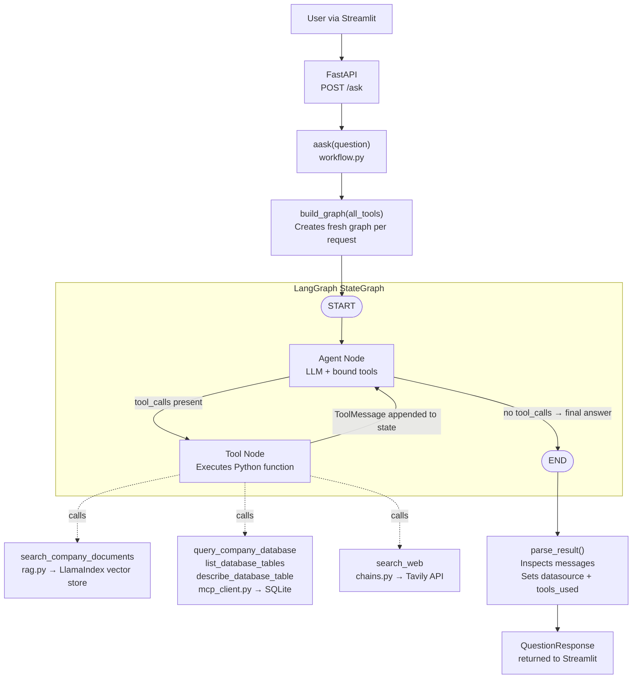

# Architecture Overview

## What this system is

The KT Agent is an **Enterprise Knowledge Transfer Assistant**. It is a conversational AI that answers questions about your company by searching internal documents, querying a structured database, or looking up the live web — all from a single chat interface.

The key design principle: **there is no hard-coded routing**. The LLM itself reads the available tools and decides at runtime which one(s) to use. Adding a new data source means writing one Python function — nothing else changes.

---

## High-Level System Overview

```
┌─────────────────────────────────────────────────────────────────┐
│                        USER'S BROWSER                           │
│                    http://localhost:8501                         │
│                  ┌──────────────────────┐                       │
│                  │   Streamlit Chat UI  │                       │
│                  │   (streamlit_app.py) │                       │
│                  └──────────┬───────────┘                       │
└─────────────────────────────│───────────────────────────────────┘
                              │  HTTP POST /ask
                              ▼
┌─────────────────────────────────────────────────────────────────┐
│                        FASTAPI BACKEND                          │
│                    http://localhost:8000                         │
│                       (app.py)                                  │
│            POST /ask  ──►  aask(question)                       │
└─────────────────────────────┬───────────────────────────────────┘
                              │
                              ▼
┌─────────────────────────────────────────────────────────────────┐
│                    LANGGRAPH AGENT LOOP                         │
│                      (workflow.py)                              │
│                                                                 │
│   ┌─────────────────────────────────────────────────────────┐   │
│   │  AgentState = { messages: [...] }                       │   │
│   │                                                         │   │
│   │   START ──► Agent Node ──► (has tool calls?)            │   │
│   │               ▲                │                        │   │
│   │               │      YES ──►  Tool Node                 │   │
│   │               └───────────────┘                        │   │
│   │                       NO ──► END                        │   │
│   └─────────────────────────────────────────────────────────┘   │
│                                                                 │
│   Tools available to the agent:                                 │
│   ┌──────────────────────┐  ┌──────────────────────────────┐   │
│   │ search_company_docs  │  │ list_database_tables         │   │
│   │ (LlamaIndex RAG)     │  │ describe_database_table      │   │
│   └──────────────────────┘  │ query_company_database       │   │
│   ┌──────────────────────┐  └──────────────────────────────┘   │
│   │ search_web           │                                      │
│   │ (Tavily API)         │                                      │
│   └──────────────────────┘                                      │
└─────────────────────────────┬───────────────────────────────────┘
                              │
              ┌───────────────┼───────────────┐
              ▼               ▼               ▼
┌─────────────────┐  ┌──────────────┐  ┌───────────────┐
│  VECTOR STORE   │  │  SQLITE DB   │  │  TAVILY API   │
│  indexing_data/ │  │  data/*.db   │  │  (live web)   │
│  (LlamaIndex)   │  │  (sqlite3)   │  └───────────────┘
└─────────────────┘  └──────────────┘
        ▲
        │ indexed from
┌───────────────────┐
│   data/ folder    │
│  *.pdf *.docx     │
│  *.xlsx *.csv     │
│  *.txt            │
└───────────────────┘
```

---

## The ReAct Agent Loop

The entire agent is a two-node LangGraph `StateGraph`. There are no other nodes — no classifier, no pre-router, no if/else logic.



### Why two nodes?

The LLM is not just the "brain" — it is also the router. It receives all 5 tool schemas (auto-generated from their docstrings) alongside the user's question. It decides:

- **No tools needed** → emits a final answer text → graph goes to END
- **One or more tools needed** → emits a `tool_calls` list → graph executes the tools, appends results to message history, and loops back to the agent

This loop continues until the LLM stops calling tools and produces a final answer. In practice, most questions resolve in 1–2 loops.

---

## The 5 Tools

| Tool | File | Triggers when... |
|---|---|---|
| `search_company_documents` | `tools.py` | Question is about internal company knowledge |
| `search_web` | `tools.py` | Question needs real-time or external information |
| `list_database_tables` | `mcp_client.py` | LLM needs to discover what tables exist in the DB |
| `describe_database_table` | `mcp_client.py` | LLM needs to know column names before writing a query |
| `query_company_database` | `mcp_client.py` | Question requires structured data from the database |

The LLM learns what each tool does from its **docstring**. Well-written docstrings are critical to correct routing.

---

## The 4 Answer Paths

Every API response includes a `datasource` field that tells you how the answer was produced:

```
datasource = "direct_llm"     → LLM answered from training data, no tools used
datasource = "company_docs"   → search_company_documents was called
datasource = "database"       → query_company_database was called
datasource = "web_search"     → search_web was called
datasource = "multiple"       → more than one tool was used
```

### Path 1 — Direct LLM

```
User: "What is a vector database?"
LLM:  Answers directly — no tool_calls emitted
→ datasource: "direct_llm"
```

### Path 2 — Company Documents (RAG)

```
User: "What does the KT document say about deployment?"
LLM:  Calls search_company_documents("deployment process")
      Tool searches LlamaIndex vector store → returns relevant text chunks
LLM:  Synthesises answer from chunks
→ datasource: "company_docs"
```

### Path 3 — Database

```
User: "What is the status of order #12345?"
LLM:  Calls list_database_tables() → sees "orders" table
      Calls describe_database_table("orders") → sees column names
      Calls query_company_database("SELECT * FROM orders WHERE id = 12345")
      → returns CSV row
LLM:  Formats the row as a natural language answer
→ datasource: "database"
```

### Path 4 — Web Search

```
User: "What is the current USD to INR exchange rate?"
LLM:  Calls search_web("USD to INR exchange rate today")
      → returns Tavily search results
LLM:  Extracts the rate from results
→ datasource: "web_search"
```

---

## Data Stores

### Vector Store (for documents)

```
data/                          ← you put your files here
  ├── report.pdf
  ├── handbook.docx
  ├── catalog.xlsx
  ├── sales.csv
  └── notes.txt
       │
       │  python -m src.agent.rag  (run once to index)
       ▼
indexing_data/                 ← auto-generated, do not edit
  ├── default__vector_store.json
  ├── docstore.json
  ├── index_store.json
  ├── graph_store.json
  └── image__vector_store.json
```

- **Supported formats:** PDF, DOCX, DOC, XLSX, XLS, CSV, TXT
- **Embedding model:** `BAAI/bge-small-en-v1.5` — runs locally, no API key needed
- **Chunk size:** 512 tokens, 50 token overlap
- **Implementation:** LlamaIndex `VectorStoreIndex` with file-based persistence
- **Loading:** `@lru_cache` — index is loaded from disk once per server process

To add new documents: copy file to `data/` → re-run `python -m src.agent.rag` → restart server.

### Company Database

- **Location:** `data/company.db`
- **Technology:** SQLite (swappable with Postgres via real MCP server)
- **Access:** Read-only — `query_company_database` rejects any SQL that is not a `SELECT`
- **Interface:** MCP-compatible `asynccontextmanager` in `mcp_client.py` — the entire DB layer can be replaced with a real MCP server without touching `workflow.py`

---

## File Responsibilities

| File | Layer | What it does |
|---|---|---|
| `streamlit_app.py` | UI | Chat interface, session state, datasource captions, sidebar sample questions |
| `app.py` | API | FastAPI — `POST /ask`, `GET /health`, Pydantic validation |
| `workflow.py` | Agent | Builds the LangGraph, defines agent node, tool node, routing, result parsing |
| `chains.py` | LLM | Factory: auto-selects Groq / Gemini / Cohere; provides Tavily tool |
| `tools.py` | Tools | `search_company_documents` (calls `rag.py`), `search_web` (calls Tavily) |
| `rag.py` | RAG | Auto-discovers files in `data/`, builds/loads LlamaIndex vector store |
| `mcp_client.py` | DB | Three database tools behind an MCP-compatible `asynccontextmanager` |
| `config.py` | Config | `DATA_DIR`, `INDEX_DIR` paths; env key validation |
| `schemas.py` | Models | `QuestionRequest`, `QuestionResponse` Pydantic models |
| `ingest_drive.py` | Ingestion | Optional: pulls documents from Google Drive into the vector store |

---

## Multi-LLM Strategy

The system is **vendor-agnostic at the agent level**. All LLM providers implement LangChain's `BaseChatModel` so `workflow.py` never references a specific provider.

```
.env keys present         →  LLM selected
──────────────────────────────────────────
GROQ_API_KEY              →  Groq  (openai/gpt-oss-120b)   ← default
GOOGLE_API_KEY            →  Gemini (gemini-1.5-flash)
COHERE_API_KEY            →  Cohere (command-r-plus)
LLM_PROVIDER=google       →  forces Google regardless of other keys
```

Priority order when multiple keys are present: **Groq → Google → Cohere**

---

## Technology Stack

| Technology | Role |
|---|---|
| **LangGraph** | Stateful ReAct agent loop (two-node StateGraph) |
| **LangChain** | `@tool` decorator, `ToolNode`, `BaseChatModel` interface |
| **LlamaIndex** | Document ingestion, chunking, HuggingFace embeddings, persisted vector store |
| **FastAPI** | Async HTTP API with Pydantic request/response validation |
| **Streamlit** | Chat UI with session state and datasource captions |
| **Groq** | Default LLM — `openai/gpt-oss-120b`, fast free-tier, tool-calling support |
| **Google Gemini** | Alternative LLM — `gemini-1.5-flash` |
| **Cohere** | Alternative LLM — `command-r-plus`, strong at RAG tasks |
| **Tavily** | Real-time web search API |
| **HuggingFace** | `BAAI/bge-small-en-v1.5` local embedding model (no API key needed) |
| **SQLite** | Company database — swappable to Postgres via MCP |
| **openpyxl** | Excel file parsing (`.xlsx`, `.xls`) |

---

## Extending the System

### Add a new tool

```python
# 1. Define in src/agent/tools.py
@tool
def get_jira_ticket(ticket_id: str) -> str:
    """Look up a Jira ticket by its ID (e.g. 'PROJ-123').
    Use this when the user asks about a specific issue or bug report."""
    ...

# 2. Register in src/agent/workflow.py
local_tools = [search_company_documents, search_web, get_jira_ticket]
```

No routing changes. The LLM starts using it automatically.

### Add a new document type

Add the file extension to `SUPPORTED_EXTENSIONS` in `src/agent/rag.py`:

```python
SUPPORTED_EXTENSIONS = {".pdf", ".docx", ".doc", ".xlsx", ".xls", ".csv", ".txt", ".md"}
```

Make sure LlamaIndex (or `unstructured`) supports parsing that format.

### Replace SQLite with Postgres

Replace `mcp_server_context()` in `mcp_client.py` with a real MCP server connection. `workflow.py` does not need to change.
