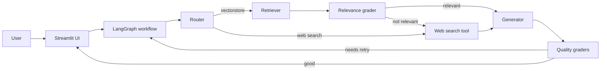

# Architecture Overview

## Purpose

This project is a knowledge-transfer assistant built as a retrieval-augmented generation (RAG) system. It combines:
- a persisted vector index for document knowledge
- a LangGraph workflow for decision-making
- LangChain prompt management for generation and grading
- Streamlit for a user interface

The goal is to let users ask project-related questions and get grounded answers, while falling back to web search when needed.

## What is LangGraph?

LangGraph is a workflow engine for AI applications. It defines a graph of nodes and conditional edges, where each node is a function that updates the workflow state.

In this project, LangGraph provides:
- a clear sequence of reasoning steps
- decision points that choose the next path dynamically
- a reusable state object shared between nodes

This is why the project is not just one prompt. It is a graph of operations with routing and retries.

## What is LangChain?

LangChain is a toolkit for building prompt-based AI applications. It helps with:
- prompt templates
- connecting prompts to models
- parsing structured outputs
- composing chains of operations

In this system, LangChain is used to create the question router, the RAG generator, and the grader prompts.

## What is LlamaIndex?

LlamaIndex creates a searchable index from documents by:
- splitting text into chunks
- generating embeddings for each chunk
- storing those vectors so they can be retrieved later

The index is persisted in `indexing_data`, which means the system can reload it without rebuilding the index on every run.

## High-level architecture

## Project layers

### 1. Ingestion layer

This layer builds the document index. It:
- loads documents from disk
- splits them into chunks
- creates embeddings with Hugging Face
- saves the index to `indexing_data`

This work is done by `indexing.py` and uses LlamaIndex to persist the vector store.

### 2. Retrieval and reasoning layer

This layer is the heart of the system and is implemented in `workflow.py`.

It handles:
- routing the question to the right source
- retrieving relevant documents from the vector index
- grading document relevance
- generating the answer
- validating the answer quality

### 3. Presentation layer

This layer is the user-facing UI in `streamlit_app.py`.

It allows the user to:
- type a question
- run the workflow
- view the generated answer

## How the workflow works

The workflow is defined as a graph of nodes.
Each node is a function with a specific responsibility.
The nodes in this project are:
- `route_question`
- `retrieve`
- `grade_documents`
- `web_search`
- `generate`
- `grade_generation_v_documents_and_question`
- `rewrite_query`

## What each node does

### route_question
- inspects the user question
- decides whether to use the vector store or web search
- returns the next node name

### retrieve
- sends the question to the vector retriever
- converts retrieved chunks into document objects
- stores them in the workflow state

### grade_documents
- checks each retrieved document for relevance
- keeps relevant documents only
- marks whether web search is needed

### web_search
- calls the external web search tool
- appends search results to the document list

### generate
- builds a prompt using retrieved context
- asks the LLM to generate an answer
- stores the generated text in state

### grade_generation_v_documents_and_question
- checks whether the generated answer is grounded in the retrieved documents
- checks whether the answer is useful for the original question
- returns a decision that may end the workflow or retry

## How the grader flow works

After generation, the system runs two grading prompts:

### Hallucination grader
This prompt checks whether the answer is supported by the documents. It asks the model to return `yes` or `no`.

If the answer is not grounded, the workflow may retry or use web search.

### Answer grader
This prompt checks whether the answer is useful for the original question. It also returns `yes` or `no`.

If the answer is not useful, the workflow can switch to web search and try again.

## Why this is useful

Using two graders improves reliability by separating:
- correctness relative to source documents
- usefulness relative to the question

This reduces the chance that the system returns a confident but irrelevant or unsupported response.

## Detailed data flow

1. User enters a question in the UI.
2. The app sends the question to the workflow.
3. `route_question` decides vector search or web search.
4. If vector search, `retrieve` gets relevant documents.
5. `grade_documents` filters those documents.
6. If there are relevant docs, `generate` produces an answer.
7. The answer is graded for grounding and usefulness.
8. If the answer is unacceptable:
   - The query is rewritten by `rewrite_query` to optimize for search
   - The graph reroutes to `web_search` using the new query
   - A `retries` counter is incremented to prevent infinite loops (max 3 retries)
9. The final answer is returned to the UI (or a failure message if max retries hit).

## Technology stack

- Python
- LangGraph: workflow orchestration
- LangChain: prompt and model chaining
- LlamaIndex: semantic indexing and retrieval
- Hugging Face embeddings: vector representation
- Google Gemini: LLM reasoning
- Tavily: web search fallback
- Streamlit: UI

## Notes for beginners

If you want to build a similar project from scratch, follow these steps:
1. choose a way to index documents (LlamaIndex or other vector store)
2. choose a prompt workflow framework (LangGraph for decision graphs)
3. define prompts for retrieval, generation, and grading
4. implement a state object for workflow data
5. make a small UI to test questions

## What is the current repo state?

- The repository represents a production-grade implementation of Self-Reflective CRAG.
- It includes features like Pydantic structured output, Tenacity retry logic for network fault tolerance, safe environment variable loading (`.env`), infinite-loop protection, and LLM query rewriting.
- The workflow and prompt designs conform to modern best practices.
