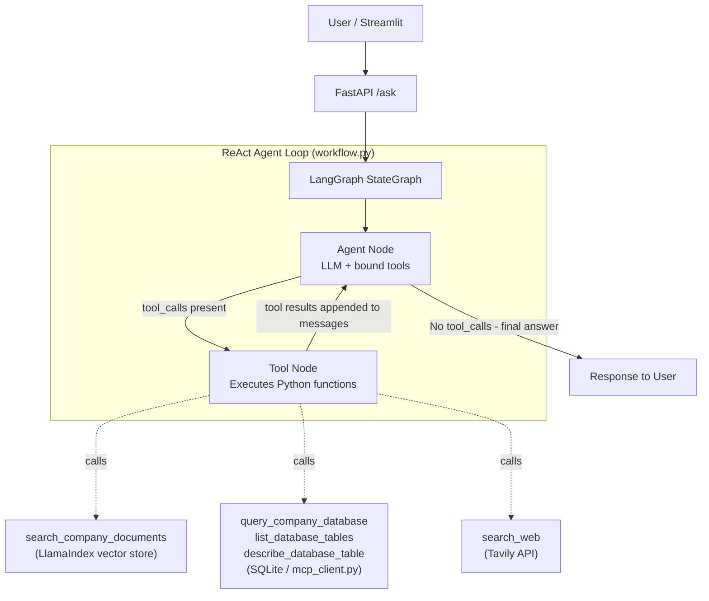

# Architecture Overview

## Purpose

This project is an **Enterprise Knowledge Transfer Assistant** built on a fully agentic architecture. It replaces legacy hard-coded routing pipelines with a dynamic ReAct (Reason + Act) loop where the LLM decides — at runtime — whether to answer directly, search documents, query a database, or look up the web.

---

## The ReAct Agent Loop

The entire system is powered by a two-node LangGraph graph. There is no pre-classification, no keyword routing, and no rigid if/else logic.



---

## How the Workflow Executes

### Step 1 — User sends a question

The Streamlit UI sends a `POST /ask` to FastAPI. FastAPI calls `aask(question)` from `workflow.py`.

### Step 2 — aask() opens the MCP context

```python
async with mcp_server_context() as mcp_tools:
    all_tools = local_tools + mcp_tools   # combines RAG + web + DB tools
    graph = build_graph(all_tools)
    result = await graph.ainvoke({...})
```

This merges local tools (`search_company_documents`, `search_web`) with database tools (`list_database_tables`, `describe_database_table`, `query_company_database`) from `mcp_client.py`.

### Step 3 — Agent Node (LLM)

The LLM receives:
- The user's question (as a `HumanMessage`)
- All tool schemas (auto-generated from `@tool` docstrings)

It either:
- **Generates a final answer** → graph routes to `END`
- **Emits a `tool_calls` list** → graph routes to the Tool Node

### Step 4 — Tool Node

LangGraph's built-in `ToolNode` executes the requested function and appends a `ToolMessage` (containing the result) to the message history.

### Step 5 — Loop back

The graph unconditionally routes back to the Agent Node. The LLM reads the tool output and generates the final answer.

---

## 4 Answer Paths

| `datasource` value | What happened | Example question |
|---|---|---|
| `direct_llm` | LLM answered from training — no tools used | "What is Python?" |
| `company_docs` | `search_company_documents` tool was called | "What is the Beacon project?" |
| `database` | `query_company_database` tool was called | "Status of order #12345?" |
| `web_search` | `search_web` tool was called | "Weather in Bangalore today?" |
| `multiple` | More than one tool was called | Multi-step research questions |

---

## File Responsibilities

| File | Role |
|---|---|
| `app.py` | FastAPI: receives HTTP requests, calls `aask()`, returns `QuestionResponse` |
| `streamlit_app.py` | Chat UI: renders messages, routes sidebar clicks, shows `datasource` caption |
| `workflow.py` | **Core:** builds `StateGraph`, defines `agent_node`, `tool_node`, `should_continue`, `parse_result`, `aask` |
| `mcp_client.py` | Database tool provider: exposes 3 SQLite tools via `asynccontextmanager` (MCP-compatible interface) |
| `tools.py` | Local tools: `search_company_documents` (RAG), `search_web` (Tavily) |
| `rag.py` | LlamaIndex: `build_index()` ingests documents; `retrieve_documents()` fetches relevant chunks |
| `chains.py` | LLM factory: auto-selects Groq / Gemini / Cohere based on `.env`; provides `get_web_search_tool()` |
| `config.py` | Paths (`DATA_DIR`, `INDEX_DIR`), env validation, logging setup |
| `schemas.py` | Pydantic models: `QuestionRequest`, `QuestionResponse` |
| `ingest_drive.py` | Optional: syncs PDFs from a Google Drive folder into the vector store |

---

## Technology Stack

| Technology | Version / Notes | Why used |
|---|---|---|
| **LangGraph** | latest | Stateful agent loop (two-node graph) |
| **LangChain** | latest | LLM wrappers, `@tool` decorator, `ToolNode` |
| **LlamaIndex** | latest | PDF/DOCX ingestion, HuggingFace embeddings, persisted index |
| **FastAPI** | latest | Async HTTP API, Pydantic validation |
| **Streamlit** | latest | Chat UI with sidebar sample questions |
| **Groq** | `openai/gpt-oss-120b` (default) | Fast, free-tier inference with tool calling |
| **Google Gemini** | `gemini-1.5-flash` | Alternative LLM |
| **Cohere** | `command-r-plus` | Alternative LLM (RAG-optimized) |
| **Tavily** | API | Real-time web search |
| **HuggingFace** | `BAAI/bge-small-en-v1.5` | Local embeddings (no API key needed) |
| **SQLite** | Built-in Python | Company database (swappable with Postgres) |

---

## Advantages of this Architecture

- **No brittle routing:** The LLM reads tool docstrings and decides routing. Adding a new tool requires zero changes to routing logic.
- **Extensible:** New tools are just Python functions with the `@tool` decorator.
- **MCP-ready:** The database tools in `mcp_client.py` use the same `asynccontextmanager` interface as a real MCP server — swap to a real MCP server without changing `workflow.py`.
- **Multi-LLM:** Switching from Groq to Gemini or Cohere is a single `.env` change.
- **Transparent:** Every API response includes `datasource` and `tools_used` so the UI can show exactly how the answer was generated.
